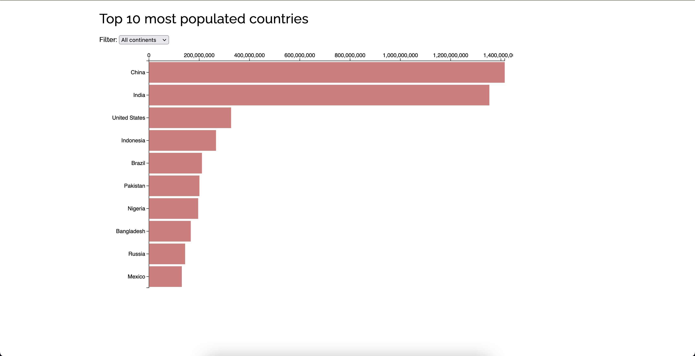
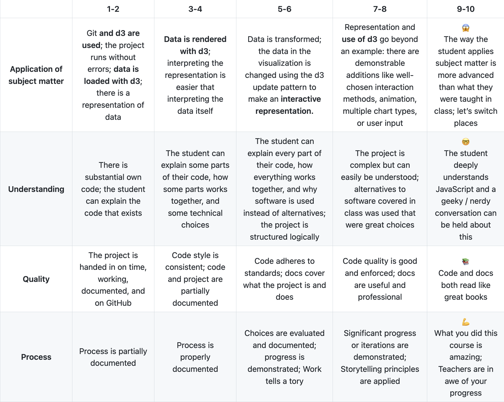

# Functional Programming

Welkom bij mijn project van functional programming.

Het is de opdracht om een interactieve D3 grafiek te maken, welke werkt met update, enter en remove. Ik heb gekozen voor een barchart met de top 10 landen met de meeste inwoners. Deze kunnen gefilterd worden op continent.

De website is [hier](#LINK HIER) te zien.

### Installatie ⚙️

Om de app lokaal te laten draaien moet het project eerst lokaal worden gecloned.
Als dit stukje code gerunt wordt in de terminal wordt de repository lokaal gecloned:

`gh repo clone tomvandenberg11/frontend-data.git`

Ga eerst naar de folder waarin je wilt dat het project gecloned wordt. Je kan in de terminal navigeren met `cd` met daar achter de map waar je heen wilt.

### Running 🏃🏻
Daarna kan het project geshowd worden door in de folder twee keer op de `index.html` te klikken, waardoor het bestand opent in de browser. Voor dit project is het niet nodig om een server te starten.

## Rubrics 🅰️
Dit zijn de rubrics waar we op beoordeeld worden:

## Licence 👨🏻‍⚖️
Dit project is voorzien van een MIT licence. Zie de pagina LICENCE voor meer informatie.

## Credits 📣

Ik wil graag als eerste de geweldige docenten bedanken voor al hun inzet en lesstof. Ten tweede wil ik mijn supportgroepje bedanken voor de mentale en functionele support. Ten derde wil ik Stackoverflow bedanken voor al hun antwoorden op mijn vragen.